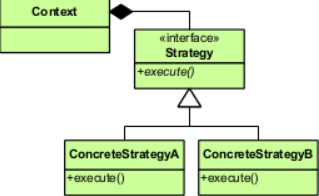

전략 패턴
========
프로그램이 진행되면서 캡슐화된 로직을 선택할 수 있게 하는 디자인 패턴.

### UML

> 로직 실행은 인터페이스에 의존을 시키고 인터페이스를 구현한 로직들을 전달해줌으로써 분기처리 없이 유연성을 갖출 수가 있습니다

### 예시
집에서 지하철역 까지 전동 킥보드, 자전거 중 하나를 선택해야하는 상황.
#### 변경될 수 있는 사항
* 자전거를 도둑맞을 수 있음
* 탈것이 새로 추가될 수 있음

